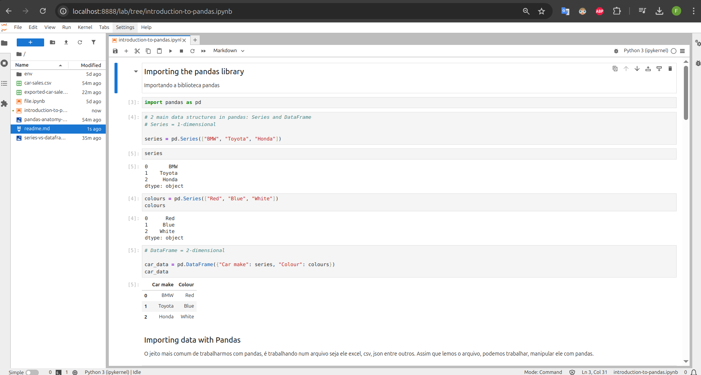

# Jupyter + ML/AI (Modern Python Setup)



## 🚀 Stack Used


### 📚 Core Tools:

- [uv](https://docs.astral.sh/uv/) - Next-generation Python package installer and resolver
- [ruff](https://docs.astral.sh/ruff/) - Extremely fast Python linter and formatter
- [pandas](https://pandas.pydata.org/docs/reference/io.html)
- [jupyter](https://jupyter.org/)
- [numpy](https://numpy.org/)
- [matplotlib](https://matplotlib.org/)
- [scikit learn](https://scikit-learn.org/stable/)
- [sql alchemy](https://www.sqlalchemy.org/)
- [plotly](https://plotly.com/python/)
- [seaborn](https://seaborn.pydata.org/)
- [faker](https://pypi.org/project/Faker/)

---

# How to Run

## 📂 Clone this repo

```bash
git clone git@github.com:fandredev/my-ml-guide.git &&
cd my-ml-guide
```

## 🔑 Environment setup

Make sure to create and/or check the `.env` using the `.env.example` file in the root directory of the project.

## 📦 Install dependencies with `uv`

This project uses `uv` for dependency management. If you don't have it installed, follow the [uv installation guide](https://docs.astral.sh/uv/getting-started/installation/).

```bash
# Install dependencies and create virtual environment
uv sync
```

## ✨ Linting and Formatting

We use `ruff` to keep the code clean and consistent.

```bash
# Run linter
uv run ruff check .

# Run formatter
uv run ruff format .
```

## 📓 Run Jupyter

```bash
uv run jupyter lab
```

---

## 📬 Contacts

- [E-mail](profissionalf.andre@gmail.com)
- [LinkedIn](https://www.linkedin.com/in/devfandre/)
- [Portfolio](https://developer-felipe-andre.vercel.app/)
- [YouTube](https://www.youtube.com/@thistate/)

## References

- [pandas exercises](https://github.com/guipsamora/pandas_exercises)
